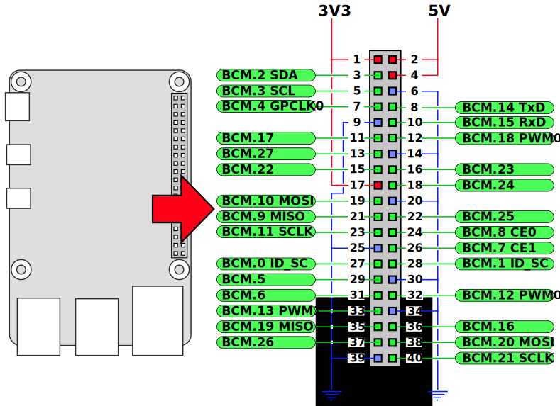
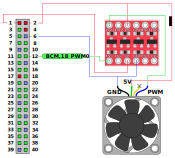

# Electrically interfacing your fan to the Pi

## General
You must use a fan with a 3- or 4-pin PWM input. Most fans run at 5V or higher, which means you have to put some kind of interface circuit between the fan and your Pi because the Pi's gpio pins runs at 3.3V. Connecting 5V directly to the Pi's 3.3V pins will most likely cause damage. Some things to consider:

1. **Power draw:** Some fans can run at 5V which can be directly taken from the Pi's pin 2 or 4. That should work fine in general, but you have to consider the total power draw. If you have other devices using power from the Pi's USB ports, you have to consider the power supply's capacity and the power consumption from the other USB devices. Make sure there's enough juice for all the pieces: the Pi itself, the USB devices AND the fan.
2. Most fans have an internal pull-up resistor on the PWM input. That makes sense, since that guarantees that the fan will run at full speed if nothing is connected to the PWM input. If there's no internal pull-up, you'd want to provide one yourself to tie the PWM input to a well-defined level under all circumstances.
3. **Inversion:** I have seen quite a few suggested "this is simple and would probably work"-solutions for converting between the Pi's 3.3V gpio pins and the fans 5+V. It's true that this is not a complicated problem, and a FET and a resistor used correctly might very well do the job. But some of the solutions I have seen actually inverts the Pi's PWM output: if a high PWM output level "opens" the transistor so that it pulls the fan's PWM-input low, you'll end up with an inverted regulation. I.e., when the PWM signal is at 100% (high for the full PWM period), the fan wil be stopped, whereas the fan will run at full speed when the PWM signal is at 0%.
4. **3- or 4-wire interface:** Both will work equally well. The only difference is that a 4-wire interface has a tacho output from the fan that delivers 2 pulses per revolution. Pi-fan does not use this signal for anything.

## Raspberry Pi 4 GPIO pins
The gpio pins on the RP4 is laid out as shown on the figure below. The labels (BCM.XXX) refer to the gpio pins on the Pi's Broadcom CPU/SoC (BCM2711) to which Pi header pins connect.

## My setup
I have interfaced my Noctua fan (40x10mm 5V fan, NF-A4x10) using one of these logic level converters ([Sparkfun BOB-12009](https://www.sparkfun.com/products/12009)). It translates the fan's 5V level to the Pi's 3.3V. Similar units can be bought many places (Adafruit, Ebay, AliExpress etc. - just Google for 'logic level converter'). My reason for choosing this solution is that it is simple, more or less fool proof and I happened to have one laying around. The Noctua is rated at 0.35W and runs fine directly of the Pi's 5V supply, with a bit of room to spare for additional units sipping power from the USB ports. Note that the tacho output from the Noctua fan (yellow wire) is not used.

